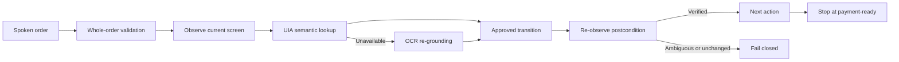

# Macro

A Windows accessibility retrofit client that turns spoken orders into verified UI actions on an existing kiosk without replacing the device or modifying its frontend source.

[한국어](./README.md)

[](https://github.com/UNITHON24/Macro/actions/workflows/quality.yml)


## Problem

Adding an alternative input method to an installed kiosk often means replacing the device or changing an application that the operator may not own. Macro runs as a sidecar process. It receives a structured order from a speech backend and operates the visible kiosk from menu selection to the payment-ready screen.

The problem also reflects Korea's current accessibility framework. Article 15 of the Disability Discrimination Act requires reasonable accommodations for equal access to unattended information terminals, with the staged application to previously installed kiosks completed on January 28, 2026. The Digital Inclusion Act Enforcement Decree identifies compatible software as one possible convenience measure. The Disability Discrimination Act Enforcement Decree, however, has broader requirements for ordinary facilities and defines specific conditions under which assistive software is accepted as an alternative.

- [Disability Discrimination Act, Article 15](https://www.law.go.kr/LSW/lsSideInfoP.do?docCls=jo&joBrNo=00&joNo=0015&lsiSeq=279699&urlMode=lsScJoRltInfoR)
- [Enforcement Decree, Article 10-2](https://law.go.kr/LSW/lsLinkCommonInfo.do?chrClsCd=010202&lspttninfSeq=179655)
- [Digital Inclusion Act Enforcement Decree, Article 15](https://www.law.go.kr/LSW/lsLinkCommonInfo.do?chrClsCd=010202&lspttninfSeq=197967)
- [Ministry of Health and Welfare 2026 rollout notice](https://www.mohw.go.kr/gallery.es?act=view&b_list=12&bid=0003&cg_code=&keyField=&list_no=379819&mid=a10505000000&nPage=10&orderby=&vlist_no_npage=23)

Macro explores a lower-cost technical path for retrofitting installed devices. Voice automation alone does not guarantee accessibility for every disability, legal compliance, product certification, or suitability for a particular deployment.

## Runtime model



The runtime is driven by meaning and observable results rather than stored coordinates.

| Layer | Responsibility |
| --- | --- |
| Windows UI Automation | Read names, roles, selection state, and invoke external controls when available |
| EasyOCR fallback | Re-locate current text on canvas-based or legacy screens |
| Kiosk profile | Store menu aliases, option semantics, observable states, and approved transitions |
| Closed-loop navigator | Enforce `observe → resolve → act → stabilize → re-observe → verify` |
| Durable order queue | Persist idempotency keys, `queued → claimed → awaiting_handoff/uncertain/completed`, and result acknowledgements in SQLite |

Calibrated coordinates are disabled unless both semantic providers fail and `KIOSK_ALLOW_COORDINATE_FALLBACK=1` is explicitly set. A YOLO-first design was rejected for the text-heavy core because its data, model, and licensing costs do not improve the primary path.

## Safety boundary

- `KIOSK_DRY_RUN=1` is the default and never moves the pointer.
- The complete order, including menu, options, and quantities, is validated before the first action.
- Ambiguous menus and equally ranked UI controls are rejected rather than guessed.
- A postcondition must remain stable across two observations before execution continues.
- A single execution lock and PyAutoGUI corner failsafe stop overlapping or emergency execution.
- The order hub refuses to start without an installation-specific `KIOSK_ORDER_TOKEN` of at least 32 characters.
- Payment-screen navigation requires `KIOSK_ALLOW_PAYMENT_NAVIGATION=1`.
- The client never enters card data, a PIN, or final payment approval.
- Once the live cart changes, no next order can be claimed until customer handoff and kiosk reset are verified.
- If a result acknowledgement is uncertain, the client stops consuming orders instead of risking a duplicate physical action.

## Quick start

The target environment is Windows with Python 3.10 or newer.

```powershell
py -m venv .venv
.venv\Scripts\activate
py -m pip install --upgrade pip
py -m pip install -r requirements.txt
```

UI Automation requires no vision model. Configure a local EasyOCR model directory if OCR fallback is needed; runtime downloads are disabled by default.

During initial provisioning only, set `KIOSK_OCR_ALLOW_DOWNLOAD=1` in a controlled networked environment, then return it to `0` for operation.

```powershell
$env:KIOSK_WINDOW_TITLE = "Target kiosk window title"
$env:KIOSK_OCR_MODEL_DIR = "C:\kiosk-models\easyocr"
py macro_pkg\macro\diagnose_kiosk.py
```

The diagnostic command is read-only. It reports the UIA/OCR elements and detected state. It can also resolve an order without touching the screen.

```powershell
py macro_pkg\macro\diagnose_kiosk.py --resolve-order '{"menuName":"americano","displayName":"아메리카노","temperature":"ICE","quantity":2}'
```

The checked-in UNITHON profile and representative order semantics can be
verified without hardware. `profile_ready` is deliberately distinct from a
physical-kiosk acceptance pass.

```powershell
py macro_pkg\macro\acceptance_kiosk.py --output profile-acceptance.json
```

On an isolated Windows test kiosk, add `--observe` to check the UIA/OCR
provider, viewport, recognized state, and default microphone's 16 kHz mono
capability without opening an audio stream, recording, clicking, moving the
pointer, or performing payment actions. The reviewed contract is
`acceptance/unithon-demo.v1.json`; a physical pass can only be produced on that
hardware.

Start against an already-running speech backend in dry-run mode:

```powershell
$tokenBytes = New-Object byte[] 32
[Security.Cryptography.RandomNumberGenerator]::Create().GetBytes($tokenBytes)
$env:KIOSK_ORDER_TOKEN = [Convert]::ToBase64String($tokenBytes)
$env:KIOSK_DRY_RUN = "1"
py macro_pkg\launcherNonback.py
```

The already-running speech backend must receive the same `KIOSK_ORDER_TOKEN` at startup and send it in the `X-Macro-Token` header on every order POST. Order submission, client claims, result acknowledgements, and microphone-status APIs are authenticated in every mode so a stored unauthenticated dry-run order cannot later cross into live execution.

Enable live input and payment-ready navigation separately only after an isolated acceptance test on the target kiosk:

```powershell
$env:KIOSK_WINDOW_TITLE = "Target kiosk window title"
$env:KIOSK_DRY_RUN = "0"
$env:KIOSK_ALLOW_PAYMENT_NAVIGATION = "1"
py macro_pkg\launcherNonback.py
```

## Adapting another kiosk

Macro is not a zero-shot agent that blindly explores an unknown payment UI. A new kiosk requires a reviewed profile:

1. Inspect UI Automation coverage with `diagnose_kiosk.py` and Windows Accessibility Insights.
2. Record screen markers, approved transitions, and control aliases in `kiosk_profile.json`.
3. Register menu names, categories, pages, and emergency reference points in `menu_cards.json`.
4. Verify menu, temperature, size, and transition planning in dry-run mode.
5. Test DPI, resolution, latency, pop-ups, and missing OCR on a non-production kiosk before live input.

`firstSetting.py` remains a compatibility calibrator for the fixed-card-grid UNITHON demo. It now runs real analysis and preserves the previous profile on an empty result, but it is not presented as a universal explorer for third-party kiosks.

## Order semantics and recovery

In the team backend contract, `menuName` is an internal code such as `americano`, while `displayName` is the visible kiosk label. The client prioritizes `displayName` and preserves `temperature`, `size`, and `quantity`. For example, `아메리카노` plus `ICE` resolves to `아이스 아메리카노`; a `LARGE` size that is not encoded in the visible name becomes a semantic target on the option screen. Other name fields remain compatibility fallbacks, but missing information that leaves two variants equally plausible is rejected before any action.

The hub stores state in `~/.macro/orders.sqlite3` by default. A verified live cart mutation remains `awaiting_handoff`; an action whose result could not be proven remains `uncertain`. Both states block the next claim until an operator verifies customer handoff or cancellation and a restored empty-cart menu screen.

```powershell
py macro_pkg\macro\manage_orders.py list
py macro_pkg\macro\manage_orders.py resolve ORDER_ID failed --side-effects-checked
```

Use `requeue` only after an operator has verified that the physical cart was not changed.

## Verification

```bash
python -m compileall -q macro_pkg tests
python -m unittest discover -s tests -v
```

CI runs the dependency-free safety core on Linux and Windows without a microphone, pointer, or external service. Tests cover semantic grounding, the demo's nested action controls, ambiguity rejection, exact native-window binding, exclusion of hidden and disabled UIA controls, viewport scaling, transition planning, temperature and size resolution, stable postconditions, payment-ready stopping, whole-order validation, execution locking, emergency cancellation, live-hub authentication, SQLite FIFO and idempotency, handoff blocking, manual recovery, and result acknowledgement.

## History and contribution boundary

Macro began at UNITHON 2024. A screen problem immediately before the demonstration was worked around with absolute coordinates, but the client could not verify the resulting screen and was difficult to reuse. The current implementation records that failure in a [troubleshooting note](./docs/troubleshooting/2024-demo-coordinate-drift.md) and replaces the demo path with a closed-loop black-box architecture.

The individual contribution covers launchers, configuration and packaging, voice-client and macro integration under `macro_pkg/`, and the current safe execution architecture. The speech backend, kiosk frontend, and initial `kioskMacro/` client are team or external components and are not presented as individual work.

## Current evidence boundary

- The deterministic safety core and checked-in demo profile are covered by automated tests.
- The current macOS development environment cannot validate Windows UIA, microphone hardware, or a physical kiosk end to end.
- Every new kiosk still requires a reviewed profile and Windows acceptance testing.
- This repository claims no public deployment, disabled-user study, accessibility certification, legal determination, or production outcome.

See [Architecture](./docs/ARCHITECTURE.md), [ADR-0002](./docs/adr/0002-black-box-semantic-automation.md), and the [work log](./WORKLOG.md) for implementation details and evidence.
