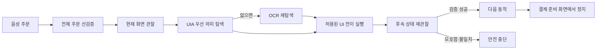

# Macro

기존 키오스크를 교체하거나 프론트엔드 소스를 수정하지 않고, 음성 주문을 현재 화면의 실제 UI 동작으로 연결하는 Windows용 접근성 retrofit 클라이언트입니다.

[English](./README.en.md)

[](https://github.com/UNITHON24/Macro/actions/workflows/quality.yml)


## 문제

음성 안내나 대체 입력이 없는 기존 키오스크에 접근성 기능을 추가하려면 기기 전체를 교체하거나 원본 애플리케이션을 수정해야 하는 경우가 많습니다. Macro는 키오스크 옆에서 별도 프로세스로 실행되며, 음성 백엔드가 만든 구조화 주문을 읽어 메뉴 선택부터 결제 준비 화면까지 대신 조작합니다.

이 문제는 제도 변화와도 맞닿아 있습니다. 장애인차별금지법 제15조는 무인정보단말기를 운영할 때 장애인이 동등하게 접근·이용하는 데 필요한 정당한 편의를 요구하고, 기존 설치 기기에 대한 단계적 적용도 2026년 1월 28일 전면화되었습니다. 현재 디지털포용법 시행령은 호환 소프트웨어 제공을 이용 편의 조치 중 하나로 명시합니다. 다만 장애인차별금지법 시행령상 일반적인 의무는 검증기준을 충족한 단말기와 위치 음성안내를 포함하며, 보조 소프트웨어가 대체 수단으로 인정되는 범위와 조건도 별도로 정해져 있습니다.

- [장애인차별금지법 제15조](https://www.law.go.kr/LSW/lsSideInfoP.do?docCls=jo&joBrNo=00&joNo=0015&lsiSeq=279699&urlMode=lsScJoRltInfoR)
- [장애인차별금지법 시행령 제10조의2](https://law.go.kr/LSW/lsLinkCommonInfo.do?chrClsCd=010202&lspttninfSeq=179655)
- [디지털포용법 시행령 제15조](https://www.law.go.kr/LSW/lsLinkCommonInfo.do?chrClsCd=010202&lspttninfSeq=197967)
- [보건복지부의 2026년 시행 안내](https://www.mohw.go.kr/gallery.es?act=view&b_list=12&bid=0003&cg_code=&keyField=&list_no=379819&mid=a10505000000&nPage=10&orderby=&vlist_no_npage=23)

Macro는 기존 기기의 접근성 대응 비용을 낮추기 위한 기술적 경로를 검증하는 프로젝트입니다. 음성 자동화만으로 모든 장애 유형의 접근성이나 법적 적합성을 보장하지 않으며, 제품 검증·현장 배치 판단을 대신하지 않습니다.

## 동작 방식



핵심은 좌표가 아니라 의미와 결과입니다.

| 계층 | 역할 |
| --- | --- |
| Windows UI Automation | 외부 프로세스가 노출한 이름·역할·선택 상태를 읽고 가능한 경우 `Invoke` 패턴 실행 |
| EasyOCR fallback | 접근성 트리가 없는 캔버스·레거시 화면에서 현재 텍스트 위치 재탐색 |
| Kiosk profile | 메뉴 별칭, 온도·사이즈 의미, 안전한 화면 상태와 허용 전이 저장 |
| Closed-loop navigator | `관찰 → 탐색 → 동작 → 안정화 → 재관찰 → postcondition 검증` 강제 |
| Durable order queue | SQLite로 `queued → claimed → awaiting_handoff/uncertain/완료` 상태와 멱등 키·결과 ACK 보존 |

좌표 데이터는 UIA와 OCR가 모두 실패하고 `KIOSK_ALLOW_COORDINATE_FALLBACK=1`을 명시한 경우에만 현재 해상도에 맞춰 보조 수단으로 사용합니다. 모든 클릭을 YOLO로 학습하는 방식은 텍스트 UI에 필요한 데이터·모델·라이선스 비용에 비해 이점이 작아 기본 설계에서 제외했습니다.

## 안전 경계

- `KIOSK_DRY_RUN=1`이 기본값이며 포인터를 움직이지 않습니다.
- 주문 전체의 메뉴, 옵션, 수량을 첫 동작 전에 검증합니다.
- 모호한 메뉴나 동일 점수의 UI 후보는 임의로 선택하지 않습니다.
- 한 화면 변화가 두 번 연속 안정적으로 관찰되어야 다음 동작으로 이동합니다.
- 주문은 한 번에 하나만 실행하며 PyAutoGUI 화면 모서리 failsafe를 유지합니다.
- 주문 허브는 32자 이상의 설치별 `KIOSK_ORDER_TOKEN` 없이는 시작하지 않습니다.
- 결제 화면 이동은 `KIOSK_ALLOW_PAYMENT_NAVIGATION=1`일 때만 수행합니다.
- 카드 삽입·PIN·결제 승인 등 실제 결제 입력은 구현하지 않았습니다.
- 장바구니가 한 번이라도 바뀌면 고객 인계와 화면 초기화를 확인할 때까지 다음 주문을 claim하지 않습니다.
- 실행 결과 ACK가 유실되면 중복 주문을 피하기 위해 클라이언트가 수신을 중단하고 운영자 검토를 요구합니다.

## 시작하기

Windows와 Python 3.10 이상을 기준으로 합니다.

```powershell
py -m venv .venv
.venv\Scripts\activate
py -m pip install --upgrade pip
py -m pip install -r requirements.txt
```

UIA는 추가 모델 없이 동작합니다. OCR fallback을 사용할 경우 EasyOCR 모델 경로를 지정합니다. 운영 중 자동 다운로드는 기본적으로 꺼져 있습니다.

처음 설치할 때만 인터넷이 허용된 관리 환경에서 `KIOSK_OCR_ALLOW_DOWNLOAD=1`로 모델을 준비하고, 실제 운영에서는 다시 `0`으로 고정합니다.

```powershell
$env:KIOSK_WINDOW_TITLE = "대상 키오스크 창 제목"
$env:KIOSK_OCR_MODEL_DIR = "C:\kiosk-models\easyocr"
py macro_pkg\macro\diagnose_kiosk.py
```

`diagnose_kiosk.py`는 현재 화면의 UIA/OCR 요소와 인식된 상태를 출력할 뿐 클릭하지 않습니다. 음성 백엔드 주문이 현재 메뉴 프로필에서 어떻게 해석되는지도 화면 동작 없이 검사할 수 있습니다.

```powershell
py macro_pkg\macro\diagnose_kiosk.py --resolve-order '{"menuName":"americano","displayName":"아메리카노","temperature":"ICE","quantity":2}'
```

저장된 UNITHON 프로필 계약과 대표 주문 해석은 플랫폼 독립적으로 먼저 검사할 수
있습니다. 이 상태는 `profile_ready`이며 실제 키오스크 합격을 뜻하지 않습니다.

```powershell
py macro_pkg\macro\acceptance_kiosk.py --output profile-acceptance.json
```

격리된 Windows 테스트 키오스크에서는 같은 명세로 UIA/OCR provider, 화면 크기,
인식 상태, 기본 마이크의 16 kHz mono 입력 지원 여부를 읽기 전용으로 확인합니다.
마이크 stream을 열거나 녹음하지 않으며 클릭·포인터 이동·결제도 수행하지 않습니다.

```powershell
$env:KIOSK_WINDOW_TITLE = "대상 키오스크 창 제목"
py macro_pkg\macro\acceptance_kiosk.py --observe --output physical-acceptance.json
```

명세는 `acceptance/unithon-demo.v1.json`에 있으며, 실제 장비 합격 보고서는 해당
장비에서 명령을 실행한 뒤에만 만들 수 있습니다.

백엔드가 이미 실행 중이라면 안전한 dry-run으로 클라이언트를 시작합니다.

```powershell
$tokenBytes = New-Object byte[] 32
[Security.Cryptography.RandomNumberGenerator]::Create().GetBytes($tokenBytes)
$env:KIOSK_ORDER_TOKEN = [Convert]::ToBase64String($tokenBytes)
$env:KIOSK_DRY_RUN = "1"
py macro_pkg\launcherNonback.py
```

이미 실행 중인 음성 백엔드도 시작할 때 같은 `KIOSK_ORDER_TOKEN`을 받아 모든 주문 POST의 `X-Macro-Token` 헤더로 보내야 합니다. 저장된 dry-run 주문이 나중에 live로 실행되는 경계를 막기 위해 주문 등록, 클라이언트 claim, 결과 ACK와 마이크 상태 API는 모든 모드에서 인증됩니다.

실제 키오스크의 격리된 테스트 환경에서 호환성 검증을 마친 뒤에만 live 입력과 결제 준비 화면 이동을 각각 활성화합니다.

```powershell
$env:KIOSK_WINDOW_TITLE = "대상 키오스크 창 제목"
$env:KIOSK_DRY_RUN = "0"
$env:KIOSK_ALLOW_PAYMENT_NAVIGATION = "1"
py macro_pkg\launcherNonback.py
```

## 새 키오스크 연결

Macro는 임의의 키오스크를 무검증 상태에서 클릭하는 제로샷 에이전트가 아닙니다. 새 기기는 다음 순서로 등록합니다.

1. `diagnose_kiosk.py`와 Windows Accessibility Insights로 UI Automation 노출 범위를 확인합니다.
2. `macro_pkg/settingPack/kiosk_profile.json`에 화면 상태, 허용 전이, 버튼 별칭을 기록합니다.
3. `menu_cards.json`에 메뉴명, 카테고리, 페이지와 비상용 기준 위치를 등록합니다.
4. dry-run으로 음성 주문의 메뉴·온도·사이즈 해석과 전이 계획을 확인합니다.
5. 테스트 키오스크에서 DPI, 해상도, 지연, 팝업, OCR 누락을 검증한 뒤 live 입력을 허용합니다.

`macro_pkg/settingPack/firstSetting.py`는 원래 UNITHON 데모처럼 고정 카드 그리드를 가진 웹 키오스크의 캡처를 위한 호환 도구입니다. 실제 분석이 실행되며 빈 결과로 기존 파일을 덮어쓰지 않지만, 모든 타사 키오스크를 자동 탐색하는 도구로 사용하지 않습니다.

## 주문 계약과 장애 복구

팀 백엔드 계약에서 `menuName`은 `americano` 같은 내부 코드이고 `displayName`은 키오스크에 표시되는 이름입니다. 클라이언트는 `displayName`을 우선 사용하며, `temperature`, `size`, `quantity`를 함께 보존합니다. 예를 들어 `displayName`의 `아메리카노`와 `ICE`는 `아이스 아메리카노`로 해석되고, 메뉴명에 포함되지 않은 `LARGE`는 옵션 화면에서 찾아야 할 의미 대상이 됩니다. 표시명이 없으면 다른 이름 필드로 호환 처리하지만, 온도가 빠져 두 메뉴가 동일하게 매칭되거나 옵션이 화면에 없으면 첫 클릭 전에 거부합니다.

주문 허브는 기본적으로 `~/.macro/orders.sqlite3`에 상태를 저장합니다. 검증된 live 장바구니 변경은 `awaiting_handoff`, 결과가 불확실한 동작은 `uncertain`으로 남습니다. 두 상태 모두 다음 주문을 막으며, 운영자가 고객 인계 또는 취소와 빈 장바구니·메뉴 화면 복귀를 확인한 뒤에만 해제합니다.

```powershell
py macro_pkg\macro\manage_orders.py list
py macro_pkg\macro\manage_orders.py resolve ORDER_ID failed --side-effects-checked
```

`requeue`는 실제 장바구니에 반영되지 않았음을 운영자가 확인한 경우에만 선택해야 합니다.

## 검증

```bash
python -m compileall -q macro_pkg tests
python -m unittest discover -s tests -v
```

CI는 Linux와 Windows에서 외부 서버·마이크·포인터 없이 같은 안전 코어를 검증합니다. 현재 테스트는 의미 grounding, 실제 데모의 중첩 action control, 후보 모호성 거부, 정확한 window handle, 숨김·비활성 UIA 제외, 해상도 좌표 스케일링, 상태 그래프, 온도·사이즈 해석, profile acceptance 계약, 안정화 확인, 결제 준비 화면 정지, 전체 주문 선검증, 실행 잠금, 긴급 중단, live 허브 인증, SQLite FIFO·멱등성·인계 대기·불확실 상태 복구, 결과 ACK를 다룹니다.

## 프로젝트 이력과 기여 범위

Macro는 UNITHON 2024에서 시작했습니다. 당시 시연 직전 화면 문제를 절대 좌표 하드코딩으로 우회했지만 결과 화면을 확인하지 않아 다른 키오스크에 재사용하기 어려웠습니다. 현재 구현은 그 실패를 [문제 해결 기록](./docs/troubleshooting/2024-demo-coordinate-drift.md)으로 남기고 소스가 없는 외부 키오스크용 폐쇄루프 구조로 교체했습니다.

개인 기여 범위는 `macro_pkg/`의 launcher·설정·음성 클라이언트와 매크로 통합, 그리고 현재의 안전 실행 구조입니다. 음성 인식 백엔드, 키오스크 프론트엔드, 초기 `kioskMacro/` 클라이언트는 팀·외부 구성요소이며 개인 성과로 주장하지 않습니다.

## 현재 검증 범위

- 표준 라이브러리 기반 안전 코어와 저장된 메뉴 프로필은 자동 테스트를 통과합니다.
- macOS 개발 환경에서는 실제 Windows UIA, 마이크, 물리 키오스크를 end-to-end로 검증하지 않았습니다.
- 새 키오스크마다 프로필 작성과 Windows 현장 acceptance test가 필요합니다.
- 공개 배포, 장애 당사자 사용자 연구, 접근성 인증, 법률 적합 판정, 운영 성과를 주장하지 않습니다.

자세한 설계와 선택 근거는 [아키텍처](./docs/ARCHITECTURE.md), [ADR-0002](./docs/adr/0002-black-box-semantic-automation.md), [작업 로그](./WORKLOG.md)에서 확인할 수 있습니다.
