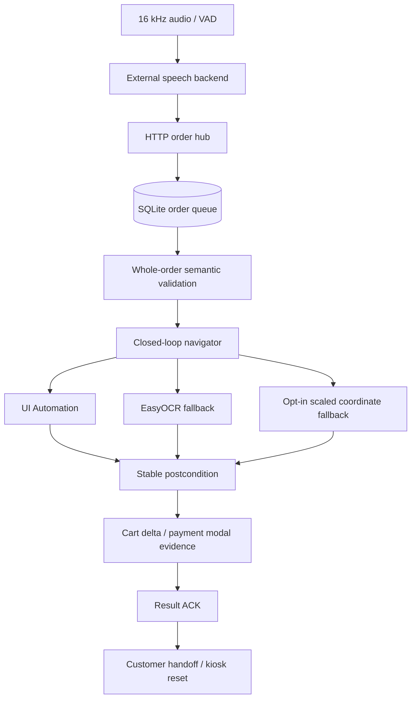

# 아키텍처와 운영 경계

## 제품 경계

Macro는 소스 코드, DOM, 전용 API를 제공받지 못한 Windows 키오스크 옆에서 실행되는 접근성 보조 클라이언트다. 구조화된 음성 주문을 현재 화면의 의미 대상에 연결하고, 장바구니 반영을 확인한 뒤 결제 방법 선택 화면에서 멈춘다. 카드 정보, PIN, 현금 투입, 결제 확인은 범위 밖이다.

기준 구현은 `macro_pkg/`다. `kioskMacro/`와 루트의 실험 파일은 UNITHON 2024 당시 팀 스냅샷이며 실행 기준이 아니다.

## 데이터 흐름



1. `audio.py`와 `audio_ws.py`가 PCM·VAD를 외부 음성 백엔드에 전달한다.
2. 백엔드는 최종 구조화 주문을 `ordersHub.py`에 POST한다.
3. 주문 허브는 payload와 멱등 키를 SQLite에 저장한다.
4. `OrdersClient`가 한 주문을 claim하고 `OrderMacro`에 전달한다.
5. `OrderMacro`는 모든 항목의 표시명, 온도, 크기, 수량을 첫 동작 전에 해석한다.
6. `Navigator`가 매 동작마다 대상 창을 관찰하고 의미 대상을 다시 찾는다.
7. 화면 전이와 장바구니 증거가 안정적으로 확인된 경우에만 다음 동작으로 간다.
8. 결과를 주문 허브에 ACK하고 결제 방법 선택 모달에서 종료한다.
9. live 장바구니가 바뀌면 고객 인계·취소와 빈 장바구니 복귀를 운영자가 확인할 때까지 다음 claim을 차단한다.

모든 모드에서 32자 이상의 `KIOSK_ORDER_TOKEN`이 필수이며 음성 백엔드, 주문 클라이언트와 overlay가 같은 `X-Macro-Token` 헤더를 사용한다. 토큰 비교는 constant-time으로 수행하고 주문 등록, claim, 결과 ACK와 마이크 상태 endpoint 전체에 적용한다. dry-run과 live가 같은 영속 DB를 사용하므로 인증 없는 dry-run 주문도 허용하지 않는다.

## 대상 창 고정

Live mode는 `KIOSK_WINDOW_TITLE`이 없으면 시작하지 않는다. 대상 제목은 정확히 한 Windows 창과 일치해야 하며, 최초 관찰에서 얻은 window handle을 세션 동안 고정한다. 최소화되거나 handle이 달라진 창은 거부한다.

UI Automation과 OCR는 같은 창 경계를 사용한다. 마이크 overlay나 다른 전면 창을 키오스크로 오인하지 않도록 UIA root는 같은 native window handle로 가져오고 OCR 캡처도 해당 창 사각형으로 자른다. offscreen·disabled UIA control과 창 밖 중심점은 후보에서 제외한다. 좌표와 프로필 영역은 창의 원점·크기에 상대적으로 계산한다.

## UI 인식 우선순위

### 1. Windows UI Automation

UIA가 노출하는 `Name`, `ControlType`, `AutomationId`, `BoundingRectangle`, 선택 상태를 읽는다. 후보가 하나로 결정되고 `Invoke` 패턴이 있으면 포인터보다 먼저 사용한다. 같은 텍스트의 서로 다른 컨트롤이 비슷한 점수로 남으면 동작하지 않는다.

### 2. OCR fallback

UIA 관찰에서 현재 목표를 찾지 못했을 때만 EasyOCR fallback을 활성화한다. 이후 세션은 UIA와 OCR를 함께 관찰한다. OCR 모델은 `KIOSK_OCR_MODEL_DIR`에서 로드하며 운영 중 다운로드는 기본 금지다.

### 3. 승인된 좌표 fallback

UIA와 OCR가 모두 실패하고 `KIOSK_ALLOW_COORDINATE_FALLBACK=1`인 경우에만 프로필의 기준점을 현재 창 크기에 맞춰 스케일링한다. 이 동작도 후속 상태 검증을 통과해야 성공이다. 절대 좌표 자체는 상태나 성공의 근거가 아니다.

## 의미 grounding과 화면 전이

`kiosk_profile.json` schema v2는 다음을 저장한다.

- 기준 viewport와 메뉴·장바구니 의미 영역
- 카테고리, 다음, 결제 버튼의 표시 별칭
- `ICE`, `HOT`, `REGULAR`, `LARGE`의 입력 별칭·메뉴 토큰·옵션 라벨
- 화면 상태별 관찰 표식과 우선순위
- 허용된 전이의 목표와 기대 postcondition
- 항목 추가 알림과 장바구니 영역

`TransitionGraph`는 좌표가 아닌 상태 이름과 의미 동작을 연결하고 표준 라이브러리 BFS로 경로를 찾는다. 기본 데모의 결제 terminal은 `결제 방법 선택` 모달이다. `카드 결제`, `현금 결제`, `결제 확인`은 누르지 않는다.

한 동작의 성공 조건은 다음과 같다.

1. 현재 화면에서 목표 후보를 하나로 결정한다.
2. UIA invoke 또는 현재 bounding box의 중심을 동작시킨다.
3. 기대 텍스트와 화면 의미 signature가 바뀐 상태를 관찰한다.
4. 같은 후속 상태가 두 번 연속 관찰되어야 안정된 것으로 본다.
5. 카테고리·페이지는 메뉴 영역에서 해당 페이지의 메뉴가 확인돼야 한다.
6. 항목 추가는 장바구니 영역의 수량·금액·항목 텍스트 변화 또는 새 성공 표식이 있어야 한다.

클릭은 발생했지만 결과를 확인하지 못한 경우는 실패가 아니라 물리적 부작용이 불명확한 `uncertain`이다.

## 주문 의미 해석

팀 백엔드의 `menuName`은 `americano` 같은 내부 코드이고 `displayName`은 키오스크에 보이는 이름이다. 해석기는 `displayName`을 먼저 사용하며, 없을 때만 다른 이름 필드를 사용한다.

```json
{
  "menuName": "americano",
  "displayName": "아메리카노",
  "temperature": "ICE",
  "size": "REGULAR",
  "quantity": 2
}
```

일반명과 온도를 함께 점수화해 `아이스 아메리카노`처럼 실제 메뉴 카드를 결정한다. 옵션이 메뉴명에 포함되지 않았다면 다음 화면에서 찾아야 할 의미 대상이 된다. 두 후보가 같은 수준으로 남거나 메뉴명과 옵션이 충돌하면 전체 주문을 실행 전에 거부한다.

## 주문 큐와 중복 방지

기본 DB는 `~/.macro/orders.sqlite3`이며 권한을 가능한 환경에서 사용자 전용으로 제한한다.

```text
queued → claimed → succeeded
                 ↘ failed
                 ↘ awaiting_handoff → operator: succeeded | failed | requeue
                 ↘ uncertain → operator: succeeded | failed | requeue
```

- DB transaction은 `claimed`, `awaiting_handoff`, `uncertain` 주문이 하나라도 있으면 다음 claim을 허용하지 않는다.
- 명시적 `Idempotency-Key`, `commandId`, `orderId`를 우선한다.
- 팀 백엔드 payload는 `sessionId + timestamp + canonical items hash`로 재전송 키를 만든다.
- 같은 키에 다른 payload가 들어오면 덮어쓰지 않고 충돌로 거부한다.
- action 이후 ACK가 불확실하면 자동 replay하지 않는다.
- `awaiting_handoff`, `uncertain`과 ACK 없이 남은 `claimed`는 `manage_orders.py`에서 실제 장바구니와 초기 화면 복귀를 확인한 후에만 처리한다.

분산 exactly-once를 주장하지 않는다. 물리 화면 동작에는 원자 transaction이 없으므로 불확실 상태를 보존하고 사람의 확인을 요구하는 것이 안전 경계다.

## 보정과 모델 공급

새 키오스크는 read-only 진단, 프로필 작성, dry-run, 비운영 기기 acceptance 순서로 연결한다. `diagnose_kiosk.py`는 UIA/OCR 요소와 상태를 출력하며 클릭하지 않는다.

기존 `firstSetting.py`는 2열 카드 그리드인 UNITHON 데모용 호환 보정기다. 분석 CLI는 실제 `analyze_dir()`를 호출하고, 1.6배 OCR 전처리 좌표를 캡처 좌표로 복원하며, 빈 분석 결과로 기존 파일을 교체하지 않는다. `ocrFirst.py`, 분석기, live observer는 모두 `macro_pkg/models` 또는 `KIOSK_OCR_MODEL_DIR`를 사용한다.

## 주요 설정

| 변수 | 기본값 | 역할 |
| --- | --- | --- |
| `KIOSK_DRY_RUN` | `1` | 모든 desktop input 비활성화 |
| `KIOSK_WINDOW_TITLE` | 빈 값 | Live에서 필수인 고유 대상 창 제목 |
| `KIOSK_UIA_ENABLED` | `1` | Windows UI Automation 관찰 |
| `KIOSK_OCR_ENABLED` | `1` | UIA 목표 누락 시 OCR fallback |
| `KIOSK_OCR_MODEL_DIR` | `macro_pkg/models` | 로컬 EasyOCR 모델 경로 |
| `KIOSK_OCR_ALLOW_DOWNLOAD` | `0` | 모델 네트워크 다운로드 명시 허용 |
| `KIOSK_ALLOW_COORDINATE_FALLBACK` | `0` | 승인된 좌표 fallback 허용 |
| `KIOSK_ALLOW_PAYMENT_NAVIGATION` | `0` | 결제 방법 선택 화면 이동 허용 |
| `KIOSK_TRANSITION_TIMEOUT_SEC` | `4.0` | postcondition 최대 대기 |
| `KIOSK_MATCH_CUTOFF` | `0.82` | 의미 후보 최소 점수 |
| `KIOSK_AMBIGUITY_MARGIN` | `0.08` | 상위 후보 간 최소 차이 |
| `KIOSK_MAX_ORDER_ITEMS` | `10` | 주문 항목 상한 |
| `KIOSK_MAX_ITEM_QUANTITY` | `10` | 항목별 수량 상한 |
| `KIOSK_ORDER_DB` | `~/.macro/orders.sqlite3` | 로컬 주문 상태 DB |
| `KIOSK_ORDER_TOKEN` | 빈 값 | 모든 모드에서 필수인 32자 이상 주문 허브 공유 secret |

## 검증 계층

자동 CI는 Linux와 Windows에서 외부 장치 없이 pure core와 replay observation을 검증한다. 검증 대상은 메뉴·옵션 해석, grounding, 중첩 action control, 모호성 거부, native window handle, 숨김·비활성 UIA 제외, 창 상대 영역, 상태 안정화, 페이지 증거, 장바구니 delta, 결제 terminal, 주문 허브 인증, 멱등성, 전역 single claim, `awaiting_handoff`와 `uncertain` 복구다.

CI가 증명하지 않는 항목은 별도 acceptance gate다.

- 실제 Windows UIA provider와 대상 키오스크의 접근성 트리
- 100%·125%·150% DPI와 복수 모니터
- EasyOCR 한국어 모델의 target-hit rate
- 마이크·음성 backend·물리 포인터 end-to-end
- 네트워크 지연, 팝업, 잠금 화면, UAC
- 장애 당사자 사용성, 접근성 검증기준, 개인정보·현장 운영 적합성

이 구분은 공개 README의 성과 주장에도 그대로 적용한다.
